## 引言 
    正如介绍所说，本文源自笔者参加的2023年6月10日的全国大学生电子设计竞赛线下培训会。
    历经对电赛小编的"软磨硬泡"，终于提前收到了完整的PPT，已存入在本git项目中，以供大家随时查阅。
    笔者期望在此做一个普及向的总结，旨在帮助对电子设计感兴趣的朋友们进一步地，"从一个工程师的角度"去理解，准备电赛。
    听完培训，笔者自身亦收益良多，颇有一种醍醐灌顶之感觉，然事必躬亲，在根据这次培训导向领航之后，需笃定前行，方得始终。
## 第二版修改导语

    经过对第一版的调研，有同学反映了重点不够突出的问题，这一版本做一个修正。
    笔者欢迎大家考完试来多提意见，希冀整理出第三版，第四版，逐步去芜存菁·······
# 培训总结正文

    张老师的培训内容极具震撼力，有格局和视野的拓展。
    可惜的是笔者10号下午准备不够充分，未能览尽本次宣讲的全部精要，实为遗憾。
    但归之于道，也算是小有所得，在此做一份个人的心得分享，以期在接下来2个月的时间内有更好的电赛指导。

### 一：以工程师的思想准备电赛
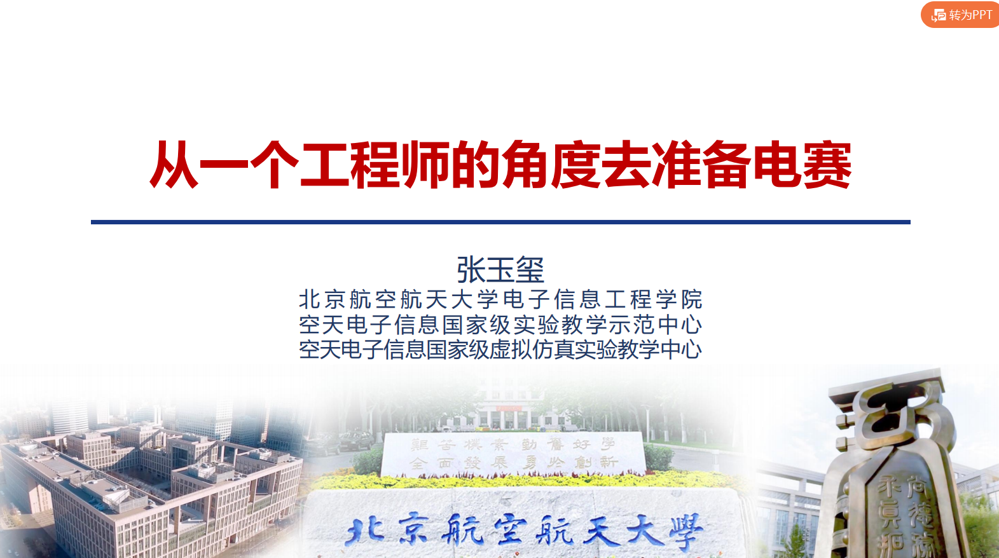

图1：PPT首页图

    所谓工程思想，就是实践为基础。
    不一定要把绝大多数的点的精确值计算出来，而更多考虑搭建实物，根据实物效果调整参数（见高频信号链知识分析）
    从信号题来讲，自2017年之后，无线通信，射频信号链（SMA,BNC接头）这一类工程以及背后的思想更多得涌现出来
    具体分为物联网IoT；低功耗；机器学习；无线通信。（也就是说，作为软件设计负责的同学，需要考虑如上因素，作为学习方向，如图2所示）

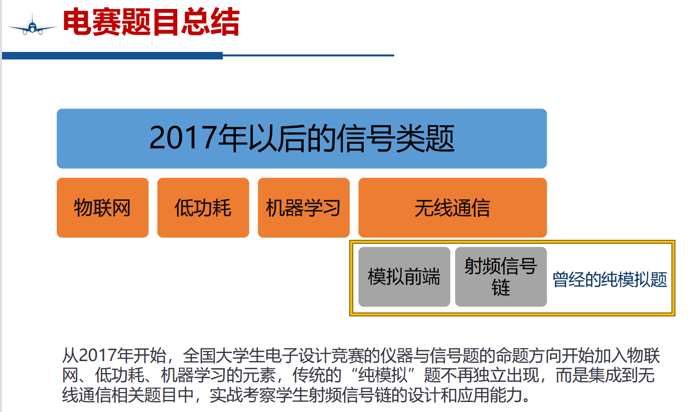

图2：电赛题目总结

### 趋势介绍与框架初析

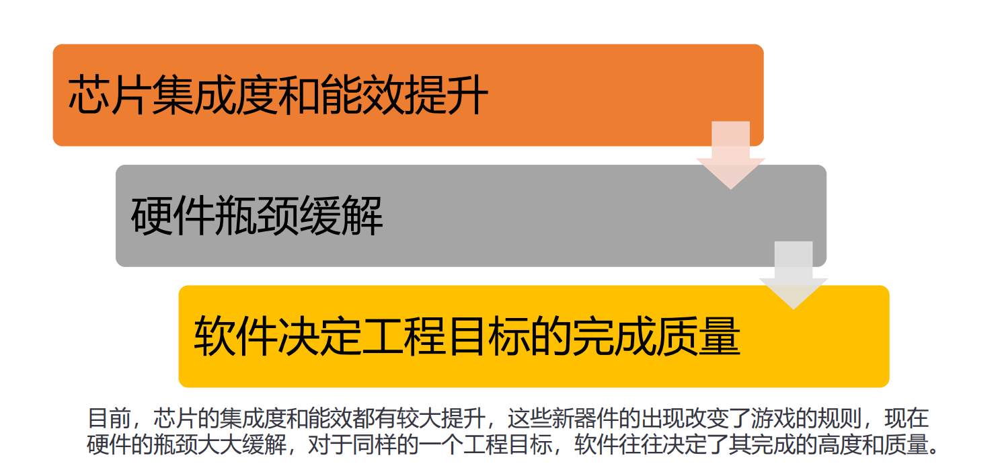

图3：电赛趋势介绍图

    主要还是低功耗问题，这个方面近年来越来越重视。
    不可否认，采用TI的MSP432（具备PCM）以及C2000处理器可以有效缓解。
    但真的要从长计议，还得学会自己设计最小系统板，精简功能。
    （本人选择TI，后者来不及了，但学问颇多。等明年可能会和老师联系设计基于卓创的最小开发板吧，希望在毕业前有机会落实此想法）
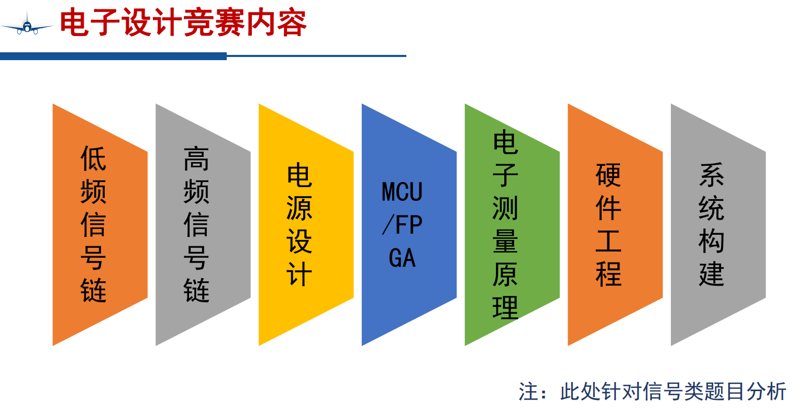

图4：电赛工程内容框架（信号类）

### 基于电赛框架的解析

#### 低频与高频信号链知识分析
        低频信号使用ADC或者DSP技术基本可以搞定。
        高频信号需要在硬件（如PCB设计）等下功夫-比如画泪滴等等，注意布线规则，容抗阻抗等等，且：
        需要注意的是，分布参数的处理，是无法精确计算的，这时就需要前述的工程思想了。
        知识点一:可变增益放大与自动增益控制
        知识点二:无源滤波器的仿真、设计和制作
        知识点三:调制解调
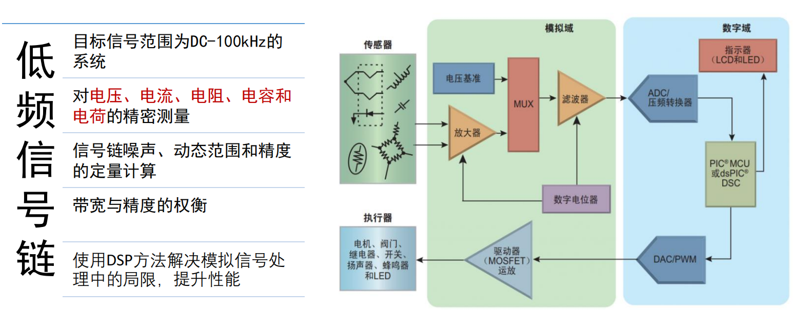
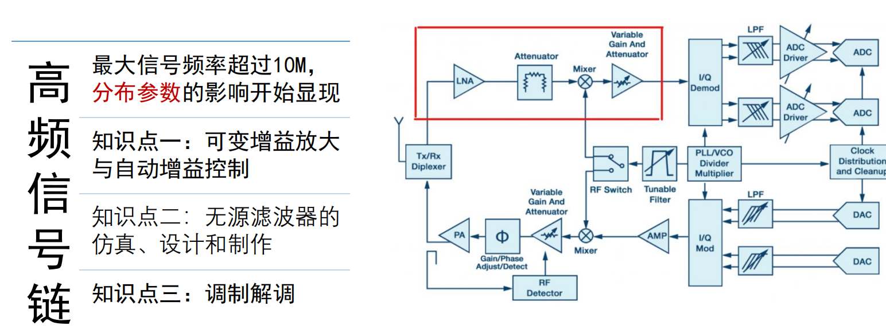

图4-5：低频与高频信号链知识分析

#### 电源设计初析

    电源是硬件设计的基础，针对负载的特性选择合适的芯片，选择合适的外围器件，留有合适的余量
    知识点一:开关电源最为灵活，可以配置为升压、降压、单电源转双电源，但噪声较大。
    知识点二: 线性电源具有低噪声的特性。设计时需掌握PSRR、耗散功率计算。
    知识点三: 低功耗系统的电源设计使用低静态电流的电源芯片，单片机能控制外围电路的开关。

    电源设计的模块会愈发重要，在后面会有专门的案例分析。
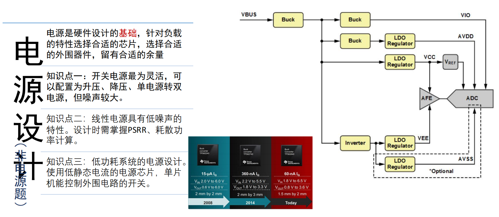

图6：电源模块设计

#### 芯片选择推荐
    1：纯小白建议建议跟进使用我们的卓创开发板（f103rbt6），社团有配套的例程和实战项目练习。
    2：具备自学能力的同学可以参考正点原子或者野火的F1开发板，资源完备，教学文档详实
    3：有一定能力可以考虑自学F4或者H7系列，和F1大同小异，且开源资料充足，也可以学习TI的MSP432P401r，但是资源较少，不过大家可以参考我写的入门教程作为指导，多交流提问
    4：想在信号，测量方面下功夫的同学，可以研究DSP系列，首推TI开发的C2000系列，如TMS320F28335，以及双核结构的LAUNCH-F28379D等TI套件，缺陷是开源资料，例程较少，本人也在亦步亦趋地开发中。
    5：以FPGA为代表的硬件加速永远的神，但需要大家自学Verilog语言，或者其他的硬件编程语言，入门建议参考书籍《搭建你的数字积木——数字电路与逻辑设计》 清华大学出版社，实验室和图书馆都有

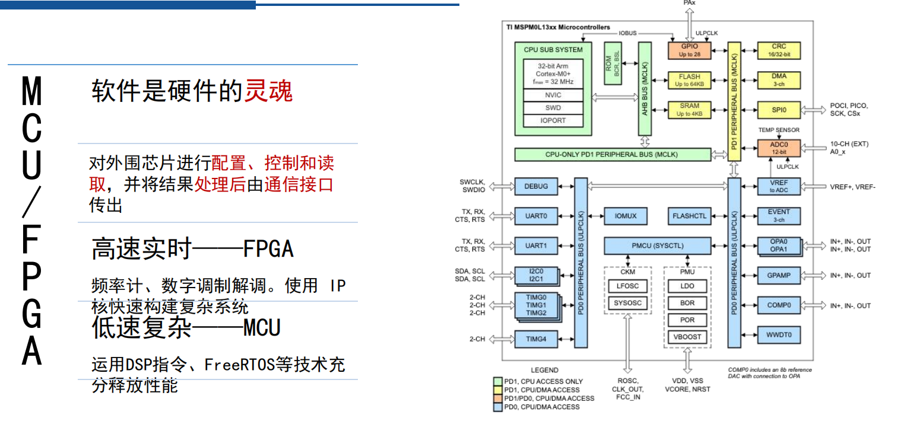

图7：MCU/FPGA

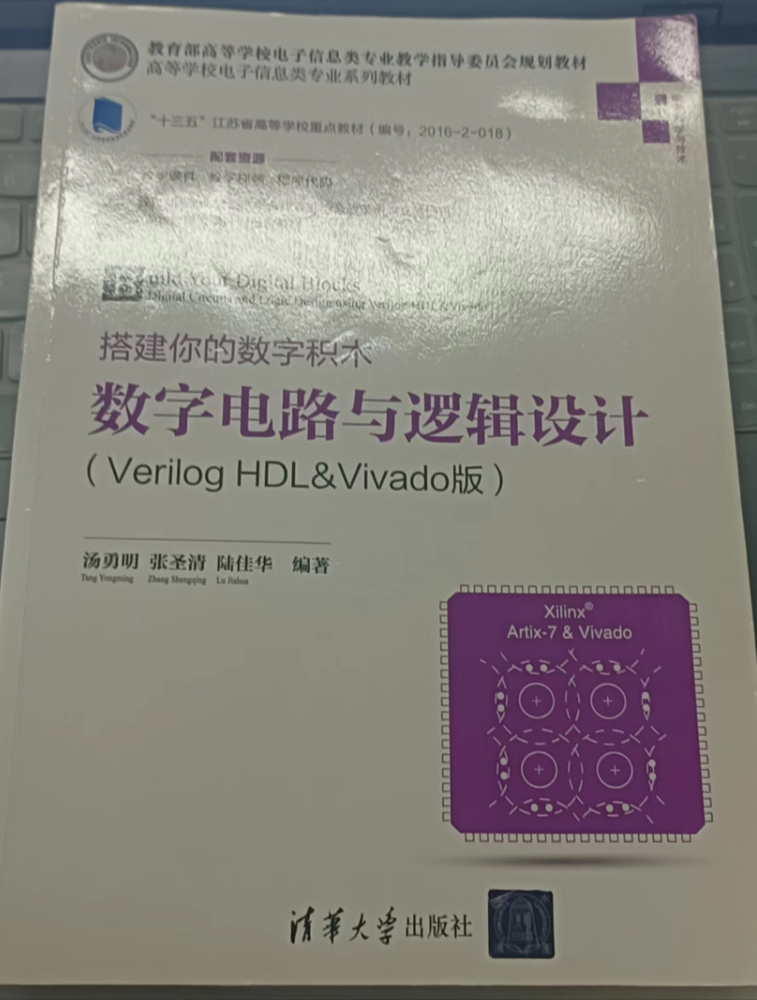

图7+：FPGA硬件加速-Verilog语言入门参考书籍

#### 电子测量原理与仪器使用

    对电压、电流、电阻、电容和电荷等电学量的测量。从基础电路开始，实践中也可以利用现有的集成电路
    检测弱信号的技巧和方法:频域窄带锁相放大、时域累积平均，并行检测...
    对信号特性进行提取，有效值、峰值、频率、相位差、正交解调

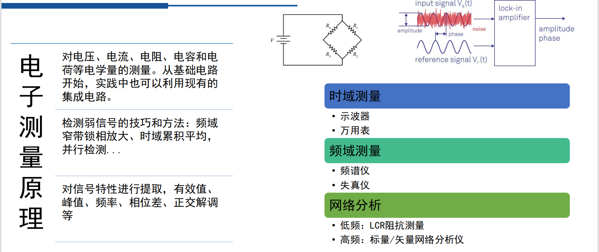

图8：电子测量原理与仪器使用

#### 仪器使用
##### 时域测量
    示波器
    万用表

##### 频域测量
    频谱仪
    失真仪

##### 网络分析
    低频:LCR阻抗测量
    实验室有KEYSIGHT的电桥，可以安排组织学习和教学,如图10所示。

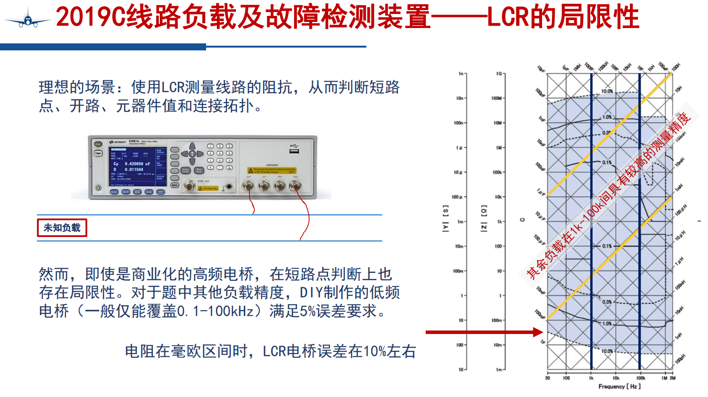

图9：电桥

图10：216实验室所属 KEYSIGHT-E4980AL 电桥实物图

    高频:标量/矢量网络分析仪
    需要说明的是，216实验室，示波器（DSO-X 2012A为主外加一台租借中的MSO5354）和万用表的需求，包括波形发生器（DG4062）,其他仪器应该都有，如有缺少可以联系我或者老师补全

### 二：以电工的思想准备硬件

#### 硬件工程架构

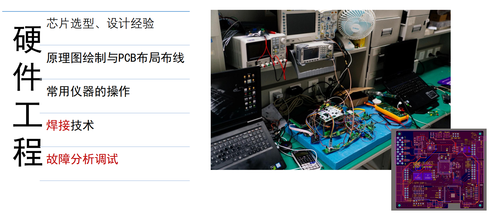

图11：硬件工程结构图

    硬件工程分为以下几点
    1 芯片选型、设计经验（前期多进行滤波，放大器，比较器等设计，积累）
    2 原理图绘制与PCB布局布线（与第一点同步进行）
    3 常用仪器的认识操作（后面着重讲述-模块化思想）
    4 焊接技术（时不时要进行锻炼，后续可能会开展进一步的，譬如贴片，0402热风枪，SOP-16焊接教学，助焊油/剂，洗板水，焊锡膏等的使用教学）
    5 故障分析调试

#### 系统整合方案

    这一部分就要求着我们进行细致化，规范化处理，这也是很多人容易忽视的一点，上次做好了的模块，这一次就忘记了，会带来很多麻烦。
    此外，系统整合更有利于系统移植，系统选型，事半功倍。这里建议使用markdown+使用Git进行管理，同步工作，就如同本markdown文档一样。

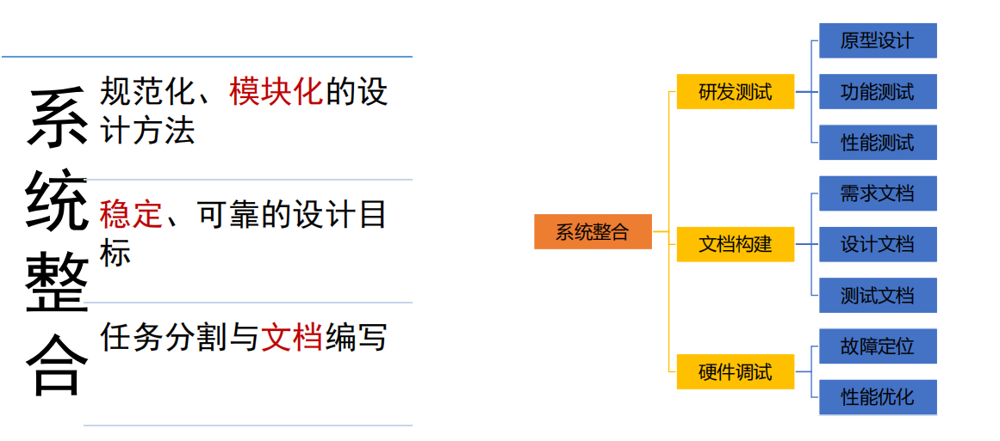

图12：研发文档整合图

### 三：模块化思想
**现在的仪器大多采用模块化构造，相较以前更容易拆卸研究，216可以拆仪器研究！！！，这部分一定要联系吕老师，因为涉及到仪器的报销报废等等，不可草率！！！**

图13：模块化思想图

#### 具体模块准备

    激励源
        直流激励:恒压源、恒流源
        交流激励:DDS、PLL
        复杂激励: AWG、调制

    信号调理
        放大
        滤波
        变换
        检测

    DUT- Device Under Test
        二端口网络
        多端口网络

    响应器
        检波器
        比较器
        解调器

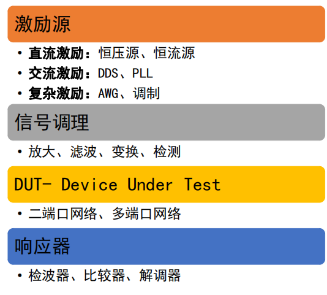

图14：仪器仪表类赛题模块准备图

#### 电赛模块化硬件设计方案

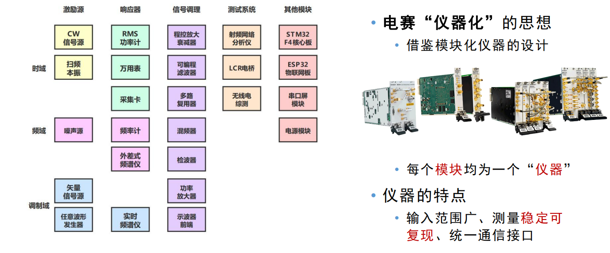

图15：模块化思想整体思维图

##### 说明：
    调制域 DDS任意波形发生器可以自备，研究
    信号调理区域大部分电路都可以提前学习准备，如MAX262程控放大器等等
    测试系统可以联系吕老师看看实验室配置
    其他模块 需要尽快准备好（电源模块怎么准备，详见后文）

##### 2019D题

    方案预览

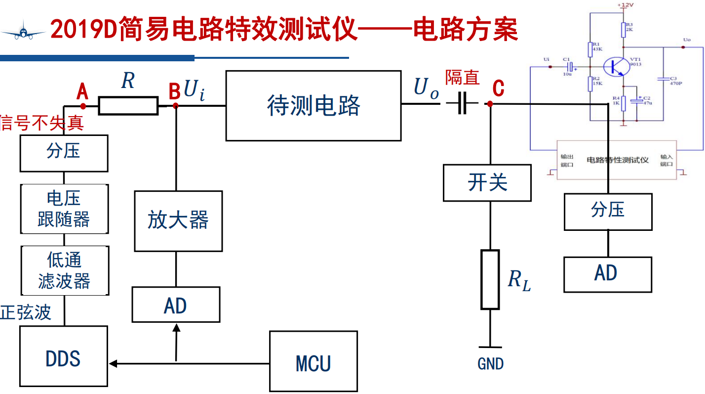

图16：2019D题北航优秀案例-电路方案

    看看人家的调试文档

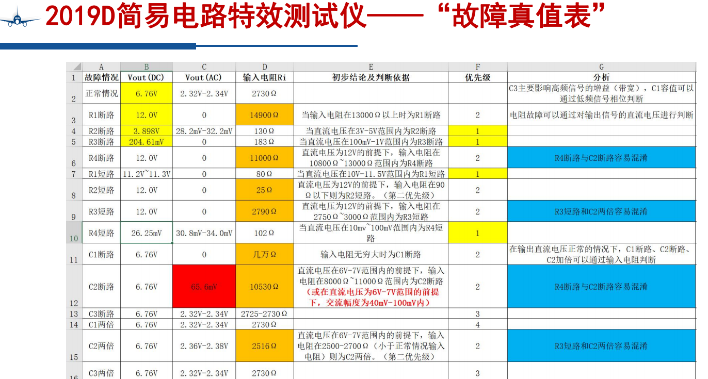

图17：2019D题北航优秀案例-故障真值表

    在我们做模块设计经验积累，模电公式分析，芯片使用分析，一定要着手制作自己的经验，设计文稿。
    建议保存在git或者思维导图上，做好引导，以供之后调用。

##### 2021E题

整体架构

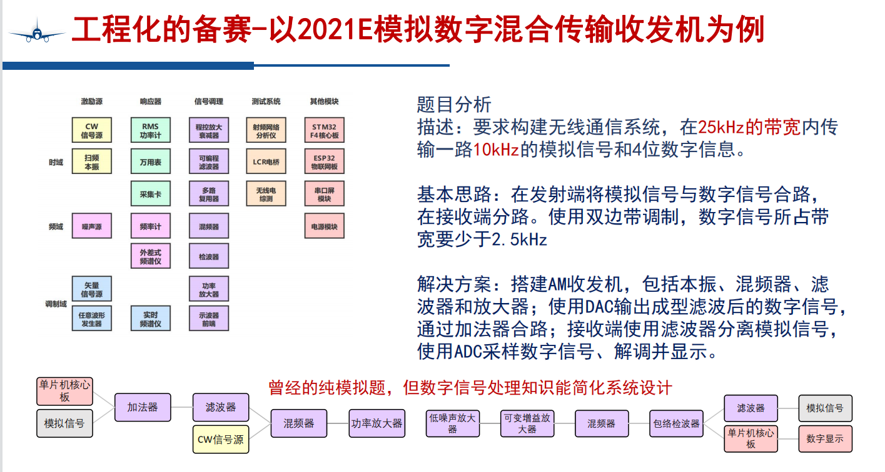

图18：2021E题整体架构

核心思路

        第一部分：单片机核心板，模拟信号输入加法器处理，滤波处理；并外接CW信号源，经过混频器与功率放大器处理
        第二部分：低噪声放大经过可变增益放大器与混频器处理，经过包络检波器分别赋予滤波器与单片机核心板，最后实现模拟信号与数字显示

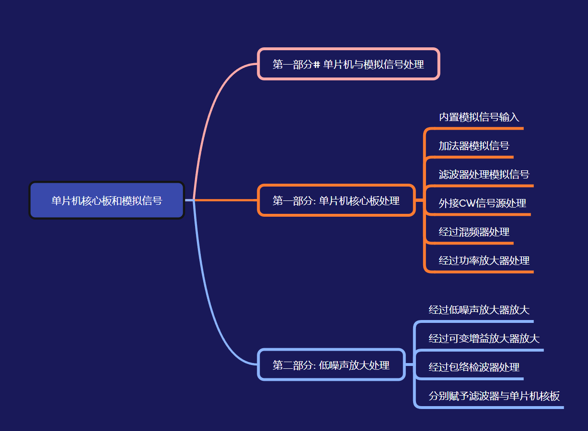

图19：2021E题思维导图-基于Xmind-copilot

MCU解决方案节选

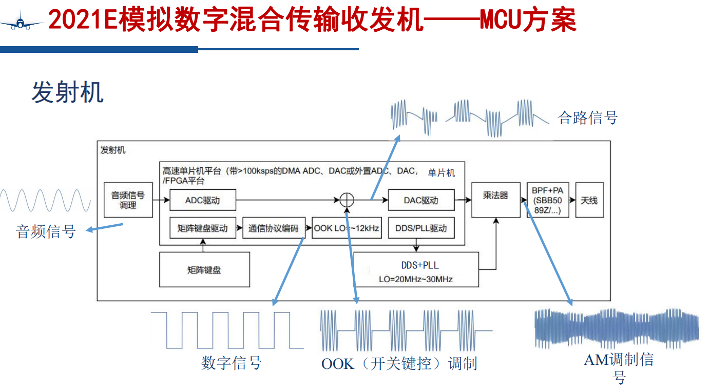

图20：2021E题MCU方案节选

## ！重点！北航学子的优秀模块化硬件设计思路展示  
## ！重点！北航学子的优秀模块化硬件设计思路展示  
## ！重点！北航学子的优秀模块化硬件设计思路展示  

**当我们还在着手单一的模块时，别人已经把模块集成到大块的板子上面了，国一实至名归**

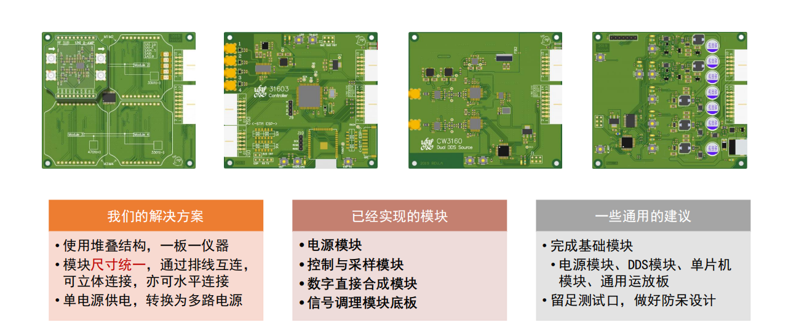

图21：北航学子的优秀模块化硬件设计整体思路

### 电源模块-把单个的稳压电源，集成到一起，极为方便与测试和选型

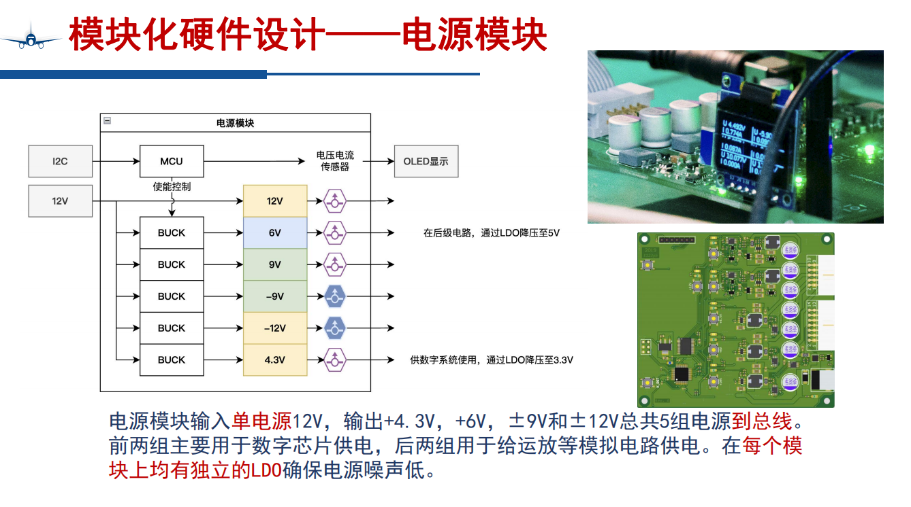

图22：北航学子集成型电源模块

    电源模块输入单电源12V，输出+4.3V，+6V，±9V和±12V总共5组电源到总线。
    前两组主要用于数字芯片供电，后两组给运放等模拟电路供电。在每个模块上均有独立的LDO确保电源噪声低。

### 信号调理模板

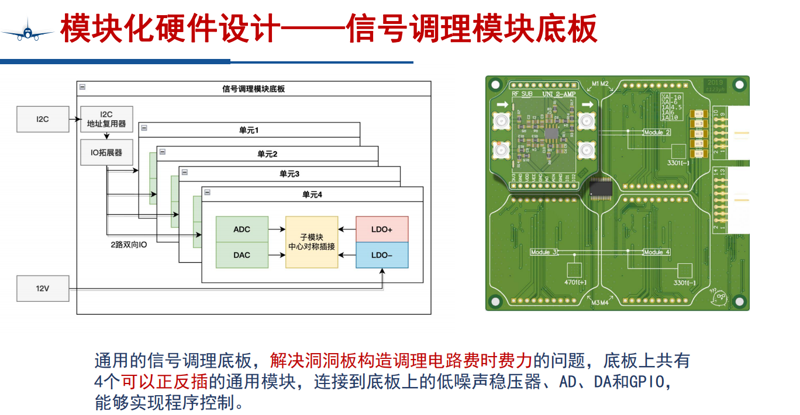

图23：北航学子集成型信号调理模块

    通用的信号调理底板，解决洞洞板构造调理电路费时费力的问题。
    底板上共有4个可以正反插的通用模块，连接到底板上的低噪声稳压器、AD、DA和GPIO，能够实现程序控制。

### 通用滤波器板

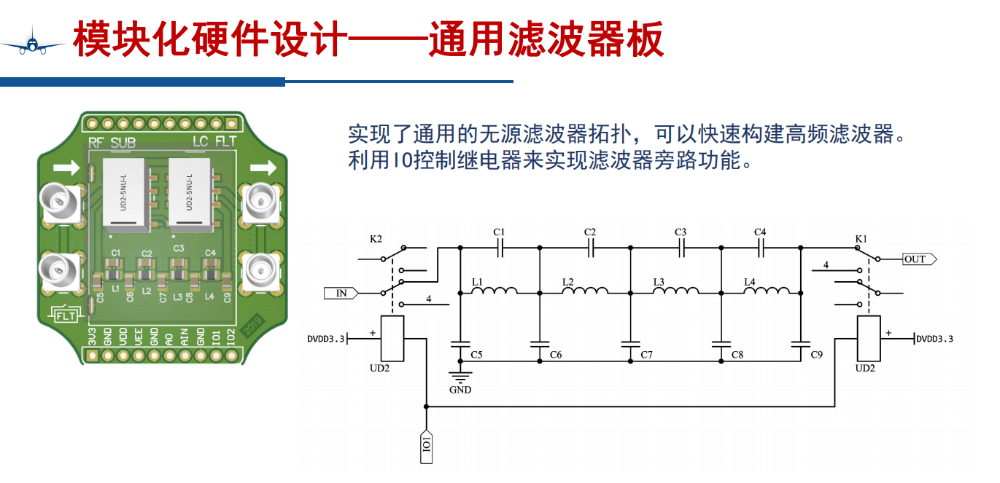

图24：北航学子集成型滤波器模块

    泰裤辣！
    实现了通用的无源滤波器拓扑，可以快速构建高频滤波器。
    利用IO控制继电器来实现滤波器旁路功能

### 国一整体硬件设计

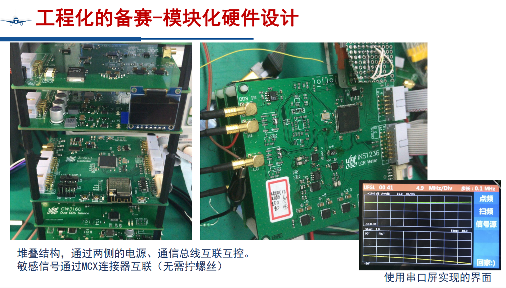

图25：堆叠结构展示

    非常具有集成化，模块化，简洁，美观，大方。
    堆叠结构，方便扩充与拆卸，通信互联。

### 四：电赛级全栈工程师知识架构
    真实世界
    虚拟世界
    知识技能

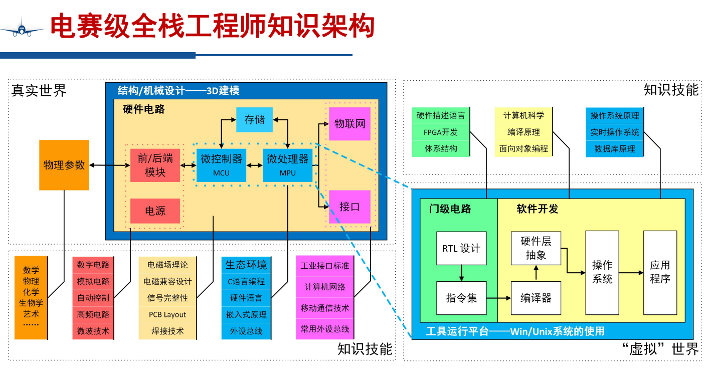

图26：全栈知识架构图

### 五：电子设计竞赛技巧（建议分工与思路安排指导）

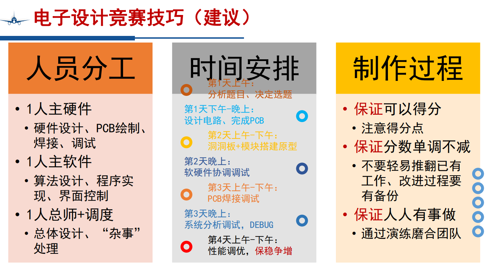

图27：分工建议图

### 六：电子设计竞赛技巧（筹备，工程设计）

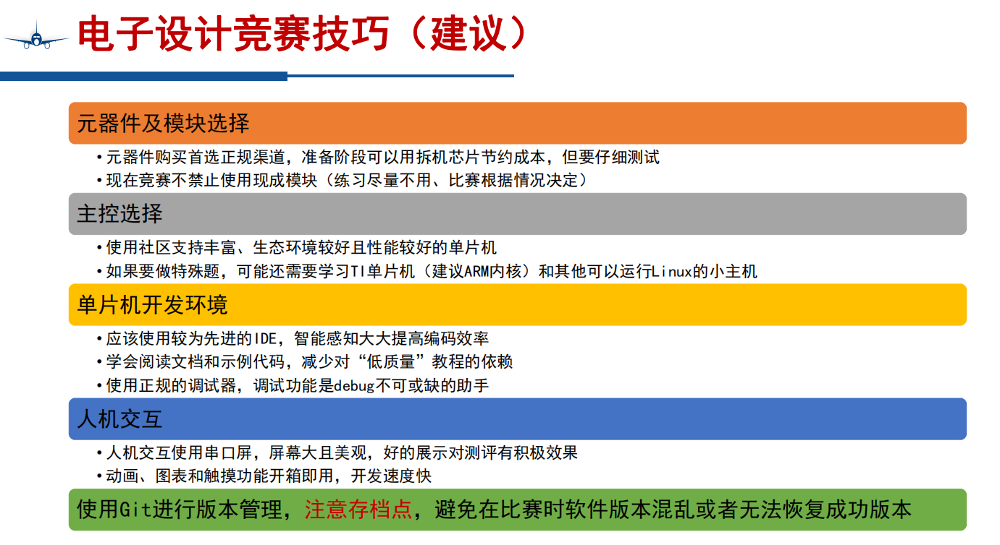

图28：技巧图

    元器件及模块选择
        元器件购买首选正规渠道，准备阶段可以用拆机芯片节约成本，但要仔细测试
        现在竞赛不禁止使用现成模块(练习尽量不用、比赛根据情况决定)

    主控选择
        使用社区支持丰富、生态环境较好且性能较好的单片机
        如果要做特殊题，可能还需要学习TI单片机(建议ARM内核)和其他可以运行Linux的小主机

    单片机开发环境
        应该使用较为先进的IDE，智能感知大大提高编码效率
        学会阅读文档和示例代码，减少对“低质量”教程的依赖（后期会出基于官方例程的教学，限于TI CCS 可能有其他的方面）
        使用正规的调试器，调试功能是debug不可或缺的助手

    人机交互
        人机交互使用串口屏，屏幕大且美观，好的展示对测评有积极效果
        动画、图表和触摸功能开箱即用，开发速度快

    使用Git进行版本管理，注意存档点！，避免在比赛时软件版本混乱或者无法恢复成功版本，也方便工程上传，分享，开源改进，技术沉淀和储存

第二版（完） 

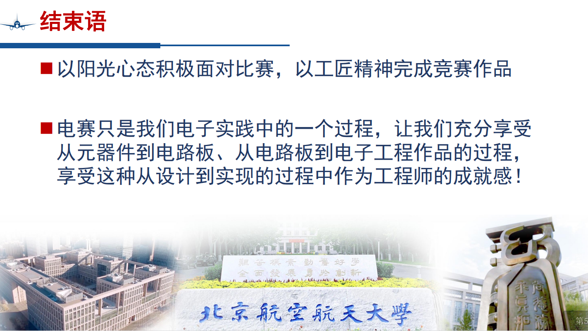

图29：结语

    本文是基于笔者个人的理解，进行经验总结，做此分享。内容大致按照张老师的框架铺张，也加入了一些笔者自身的思考。
    请大家怀揣critical的眼光取本文档的精华，去之糟粕。

本文笔者信息

    自E202 王雨声 
    微信号w1228674605 
    邮箱w1228674605@163.com
    笔者会逐渐把MSP432,DSP28335,F28379D等TI开发套件的学习笔记整理上传到github上，敬请期待
    MSP432已经上传完成，Gitee链接<https://gitee.com/ww2064188173/MSP_432_learning_material> ----- 第二版加注。

